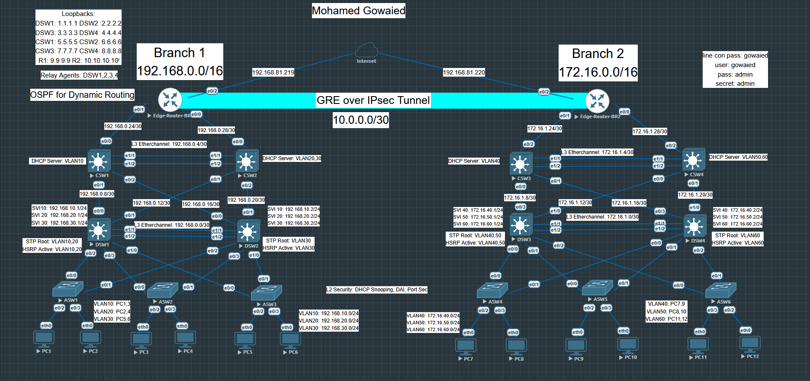

# Full-Enterprise-Branch-to-Branch-Connecticity-lab-on-EVENG

This lab demonstrates a full end-to-end enterprise network between **two branches**, connected over the Internet with **GRE over IPsec VPN**, VLANs, HSRP, OSPF, and Layer-2 security.

## 🔍 Lab Topology

## Branch LAN Designs (Built From A to Z)

  - Each branch includes a full enterprise-style hierarchical network with:
  - VLAN segmentation across Access, Distribution & Core layers
  - HSRP for default gateway redundancy
  - Rapid PVST+ for Layer-2 loop prevention
  - Synchronized HSRP + STP for optimal failover
  - SVIs on Distribution switches for Inter-VLAN Routing
  - DHCP pools on Core switches for dynamic address management
  - DHCP Relay Agents for routing DHCP requests
  - L3 EtherChannels between Distribution and Core to increase bandwidth and redundancy
  - Loopback interfaces for consistent device ID & routing references
- Result:
   - All VLANs inside each branch can communicate seamlessly and reliably.

## WAN & Secure Branch-to-Branch Connectivity
 - I configured:
   - OSPF for dynamic routing between all internal subnets
   - Static routes for internet access
   - GRE over IPsec Tunnel between the two edge routers
- This allows both branches to communicate securely over the Internet using private IPs, just like a real enterprise WAN.
  - Result:
    - Full branch-to-branch private connectivity with encryption and routing stability.

## Layer-2 Security Applied Across the Network

  - To harden the LAN, I enabled:
    - DHCP Snooping
    - Dynamic ARP Inspection (DAI)
    - Port Security on access ports
 - Result:
    - Protection against rogue DHCP servers, ARP spoofing, and unauthorized device access.

  
## Final Outcome
  - Every device in both branches can access the internet
  - All VLANs communicate internally
  - Both branches communicate over a secure GRE/IPsec VPN
  - Full redundancy, stability, and scalability across the entire topology

## 🚀 How to Use This Lab
1. Import the topology file into EVE-NG.
2. Deploy all devices according to the topology.
3. Apply the configuration files.
4. Test connectivity and VPN functionality.

## ✅ Validation / Verification
- Ping between VLANs inside each branch
- Ping between branch LANs over GRE/IPsec
- Show OSPF neighbors (`show ip ospf neighbor`)
- Show HSRP status (`show hsrp brief`)
- Show IPsec tunnel (`show crypto isakmp sa`, `show crypto ipsec sa`)

## 📚 References
- [Cisco Documentation](https://www.cisco.com/)
- [EVE-NG Documentation](https://www.eve-ng.net/)
